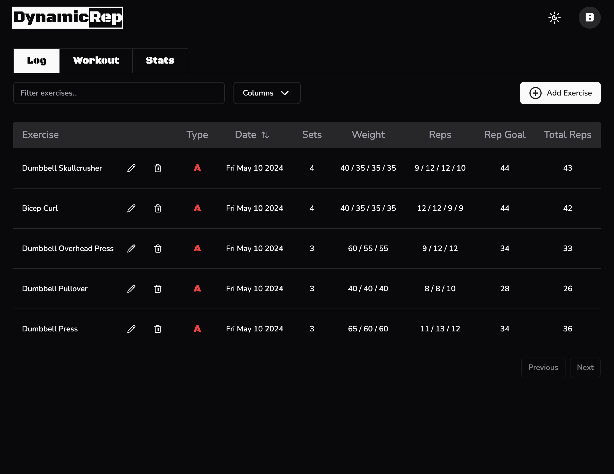

# DynamicRep

## Overview

The Exercise Logger is a personal project developed to help fitness enthusiasts track their workouts and progress effectively. Inspired by the dynamic rep goal system, this application aims to provide users with a seamless way to log their exercises and monitor their performance over time.

## Motivation

As a fitness enthusiast myself, I found the traditional methods of tracking workouts, such as using the Notes app on my iPhone, to be cumbersome and disorganized. I needed a solution to simplify the tracking process. Thus, DynamicRep was born.

## Dynamic Rep Goal System

DynamicRep utilizes a dynamic rep goal system to drive progress and results. Users set personalized rep goal targets for each exercise, aiming to achieve a specific total number of reps across all sets. This innovative approach encourages gradual progression and prevents overloading, leading to sustained improvements in strength and performance.

## Determining Rep Goal Target

To determine the rep goal target, users multiply the average number of reps (rep range you want to work in) by the total number of sets. Additionally, it's recommended to set the rep goal target slightly higher than the calculated value to accommodate fluctuations in performance.

**Example:**

- Bench press 180 pounds for 3 sets. Perform all 3 sets for max safe reps and add up the total reps performed.

- Assign a rep goal target: lets say you want to average 7 reps per set. You're doing 3 sets of bench press, you multiply 3 by 7 for a total of 21.

- Take total (21), adjust the rep goal target slightly to accomodate the drop in total reps that occurs when you add weight.

- Set rep goal target generally 2-4 reps higher than the average you want to hit. In this example, we'll go with 4 for a total of 25 reps.

- 25 reps is the target for bench press.

## Dynamic Progression

The dynamic aspect of the system comes into play when users achieve the rep goal target. Instead of immediately increasing the weight across all sets, users incrementally progress by increasing the weight on specific sets. This approach ensures gradual adaptation and prevents overloading.

Using the bench press example from above, when you perform 25 total reps for these 3 sets, you move the weight up minimally (5-10%), but only move up the weight of the first set. When you hit the rep goal total again, move up the weight of the second set. Continue this pattern until you move up the weight on all sets, and repeat the process.

**Wokout #1 looks like this...**

- Set 1: 180 for 11 reps

- Set 2: 180 for 9 reps
- Set 3: 180 for 6 reps
- Total reps = 26

The next time you bench you use 185 for set 1, 180 for sets 2 and 3 and aim for the same rep goal total of 25.

**Workout #2:**

- Set 1: 185 for 9 reps

- Set 2: 180 for 8 reps
- Set 3: 180 for 6 reps
- Total reps = 23

## Features

DynamicRep offers a comprehensive set of features to streamline workout tracking and enhance performance monitoring:

- Exercise Logging: Log exercises with ease by entering details such as exercise name, type ('A', 'B', 'None'), rep goal, number of sets, weight used per set, and reps performed each set.

- Interactive Table: View logged exercises in an easy-to-read table format, with options to toggle between different columns for personalized viewing preferences.

- Search Functionality: Utilize the search input to quickly filter exercises in the table, making it effortless to find specific workouts.

- Workout Plans: Access pre-designed workout plan, the full-body workout and suggested schedules for optimal training consistency.

## Get Started

Experience the power of [DynamicRep]() by visiting the website and creating an account today. Start logging your workouts and unlock the full potential of the dynamic rep goal system to transform your fitness journey.

## Feedback

If you have any suggestions or encounter any issues, please don't hesitate to reach out. Your input is greatly appreciated!
